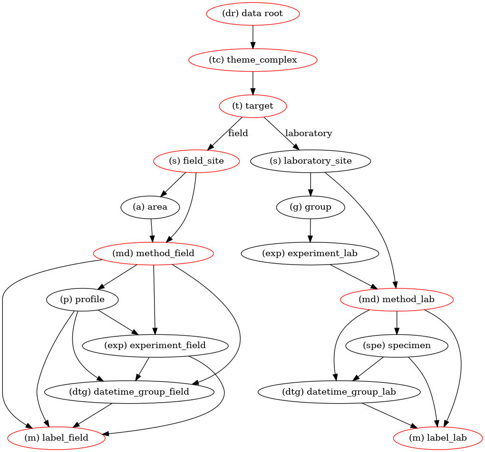

# ubg_data_management

## Introduction

Data management is hard.

Data management in small (work) groups is even harder, especially if data is
very inhomogeneous, often incomplete, and data (format) standards are missing
in a given field of research.

**Goal: This repository presents work of the Geophysics Section of the
University of Bonn to develop a set of guidelines, meta-data entries, and
Python helper scripts for a base research data management.**

### Problems with data management (DM)

* DM is tedious, and often does not lead to direct benefits for the researcher
* Often, guidelines and standards are missing for data management on the lowest
  level of research, i.e., at the level of data creation
* DM is resource intensive. Commonly, metadata is entered and stored in
  database, which need to be set up and maintained, including front end
software for data input and validation
* In research environments, there often is a frequent staff turn-over,
  complicating long-term maintenance issues

### Our approach

We aim to alleviate the issue of data management at the lowest level by

* defining a simple directory structure to store heterogeneous research data
  (the **data tree**)
* defining a simple set of metadata entries that are stored in human- and
  machine-readable .ini format within the directory structure
* provide a set of python libraries and helper scripts for simple DM tasks,
  such as adding new data to a data tree, or listing all available measurements

### Onion-shell principle

We recognize that DM requirements vary across institutions, even between
individual researchers.

We envision our DM practices the smallest shell of a DM stack, as a basic fall
back that requires no special hardware or expert skills.

If resources are available, the metadata files stored in the data tree can be
scanned and imported in a database, and built upon to create sophisticated DM
practices.

The data tree can also be used for easy export and subsequent import into
larger-scale DM operations, such as often operated by research projects or
larger research institutions.

### Required hard- and software

* A directory tree can be created by hand, if required. Therefore, only a
  computer and a file browser is required
* In order to use the provided Python scripts and libraries, a working Python
  interpreter is required, as well as the following packages:

  * numpy
  * prompt_toolkit
  * pandas

## The data tree

A data tree consists of pre-defined levels, some of which are optional.
Each directory level is uniquely identified by a two-character prefix,
separated by the level name by an underscore.
 Some levels are restricted to a certain set of possible level names (i.e., the
**target** level only allows the values *field* or *laboratory*).

The following image visualizes the directory structure:

  

  An example a directory tree (with only one measurement) is:

  ```
  └── dr_data
    └── tc_hydrogeophysics
        └── t_field
            └── s_Spiekeroog
                └── a_North
                    └── md_ERT
                        └── p_p_01_nor
                            └── m_01_p1_nor
                                ├── metadata.ini
                                └── RawData
                                    └── data.dat
  ```
### Measurement directories

Measurement directories (starting with *m_*) can contain the following
subdirectories (it is advised to not create empty directories):

* **Analysis/** directories are `free-for-all', that is, no internal structure
  is prescribed. Use these directories to store relevant analysis steps (but in
  general, analysis should happen outside a data directory tree!)
* **DataProcessed/** holds processed data, e.g., with certain corrections or
  clean-ups applied. Ensure proper documentation!
* **DataRaw/** holds the raw data, as downloaded from the device
* **Documentation/** contains all auxiliary data that can not be included in
  the metadata file. This includes maps, pdfs, literature and external
  documentation
* **Pictures/** Store relevant pictures of the measurement in here

### Special directories

* All levels are allowed to include an subdirectory *Documentation*. This
  directory can contain arbitrary information that is considered important for
  a given level/measurement. Use these directories to store auxiliary
  information, such as maps, notebook scans, programming information of
  measurement devices, etc.
* The *dr_[DATA ROOT NAME]* directory can contain a subdirectory *.management*.
  This directory is used to store temporary/caching data of the data toolbox.
  It can always be safely deleted without removing any relevant data.
  The directory is used, for example, to store a list of currently-used ids.

## The metadata entries

A typical *metadata.ini* file can look like this:

    [general]
    label = 20240610_ert_p1_nor
    person_responsible = Maximilian Weigand
    person_email = mw@domain.com
    theme_complex = Hydrogeophysics
    datetime_start = 20240610_1200
    description = A small test measurement
        Note that some entries are multi-line capable!
    survey_type = field
    method = ERT
    completed = yes

    [field]
    site = Spiekeroog
    area = north
    profile = p_01

    [geoelectrics]
    profile_direction = normal


Metadata entries are comprised of "key=value" pairs, grouped by *[sections]*.

## The Python helper libraries and scripts

### Adding new data

The command **dm_add** can be used to easily add data to an existing, or new,
data tree. The command will display information in the terminal (command line)
and ask for input.

    Example:

        $ dm_add -t dr_data -i walkthrough.qmd
        --------------------------------------------------------------------------------
        Input: ['walkthrough.qmd']
        Output Data Tree: dr_data
        --------------------------------------------------------------------------------

        Filename with highest priority /home/mweigand/.data_toolbox/ub_geoph_dm.cfg
        --------------------------------------------------------------------------------
                Please enter required metadata entries:
        --------------------------------------------------------------------------------

        --------------------------------------------------------------------------------
        Delete last 100 characters: STRG - a
        Ignore current input and go backwards: STRG - u
        Commit current input and stop data input STRG - z
        There are autocomplete values available (Press TAB).
        --------------------------------------------------------------------------------
        Field or laboratory measurements? Allowed values: field, laboratory
        Enter value for general.survey_type: field

### Checking an existing directory tree

    $ dm_check_dirtree
    Working in directory /home/mweigand/test/dr_data
    ################################################################################
    Checking directory structure of directory: /home/mweigand/test/dr_data
    ................................................................................
    Directory dr_data
        Directory dr_data/tc_Hydrogeophysics
            Directory dr_data/tc_Hydrogeophysics/t_field
                Directory dr_data/tc_Hydrogeophysics/t_field/s_Spiekeroog
                    Directory dr_data/tc_Hydrogeophysics/t_field/s_Spiekeroog/a_HausAmMeer
                        Directory dr_data/tc_Hydrogeophysics/t_field/s_Spiekeroog/a_HausAmMeer/md_TEMP
                            Directory dr_data/tc_Hydrogeophysics/t_field/s_Spiekeroog/a_HausAmMeer/md_TEMP/p_profile_02
                                Directory dr_data/tc_Hydrogeophysics/t_field/s_Spiekeroog/a_HausAmMeer/md_TEMP/p_profile_02/m_2025.2asd
                                    Check empty directories:  ok
                                    Check for required metadata.ini file:  ok
                                    Check for required metadata entries
                                        Required entry [geoelectrics]-profile_direction is missing
                                        Required entry [geoelectrics]-electrode_positions is missing

                                    Check metadata contents
                                        OK: [general][datetime_start]

                    Directory dr_data/tc_Hydrogeophysics/t_field/s_Spiekeroog/a_north
                        Directory dr_data/tc_Hydrogeophysics/t_field/s_Spiekeroog/a_north/md_ERT
                            Directory dr_data/tc_Hydrogeophysics/t_field/s_Spiekeroog/a_north/md_ERT/p_p_01
                                Directory dr_data/tc_Hydrogeophysics/t_field/s_Spiekeroog/a_north/md_ERT/p_p_01/m_very_important
                                    Check empty directories:  ok
                                    Check for required metadata.ini file:  ok
                                    Check for required metadata entries
                                        Required entry [general]-description is empty
                                        Required entry [geoelectrics]-electrode_positions is empty

                                    Check metadata contents
                                        FAIL: [general][datetime_start] is not a valid date format!
    ################################################################################

# Installation

The easiest way to install the data toolbox is using the Pypi package:

	pip install ubg_data_toolbox

You can also clone this directory and install from there:

	git clone https://github.com/geophysics-ubonn/ubg_data_toolbox
	cd ubg_data_toolbox
	pip install .

# Questions

* How do I merge two data trees?
 TODO
* Isn't adding all the metadata of a given site/location highly repetitive?

  Yes, but it also keeps things simple. The metadata definition, and the Python
library, already support metadata added to different levels of a data tree.
This way, common metadata entries can be propagated downwards.

  This approach, however, introduces quite some complications:
    * How to deal with inconsistent data (must be dealt with when integrating existing measurement directories into a data tree)?
    * The tools to add new data files (e.g., **dm_add**) must be aware of this existing metadata to automatically include it (and point out inconstencies)
